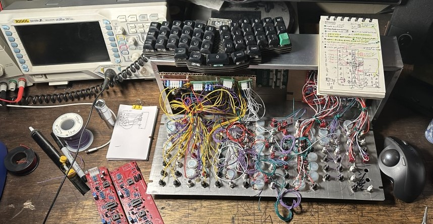

# [[serge]]

- see boat 1 in action [here](https://youtu.be/GMgH82zM7n4)
> my serge inspired modular synthesizer build 2021 - ????

# inspiration 
- "You are only as expressive as your control voltages" - Todd Barton
- "One does in fact "synthesize" a synthesizer" - Peter Blasser
- V'ger (star trek) - only its creator could help it to leap beyond Logic
- Surge Deposit
- [Dr Weiner](https://www.youtube.com/channel/UCG_j3zZV08twRJIg-_e6lOg)
- Todd Barton
- Doug Lynner
- [cybernetics with synthesizers](https://www.youtube.com/watch?v=MnYkqlSIr_I&t=15s)

# modules: 
## boat1 (voice 1)
- CGS597 NOISE-SnH
- CGS381 VOLT PROC
- CGS85 TWS
- CGS348 VCO
- CGS577 1973 VCF
- CGS514 DUSG
- CGS LPG
- CGS92 SSG
## boat2 (voice 2)
- Dual Stroh 258j Oscillators
- CGS579 Ring Mod
- CGS513 Wave Multipliers
- CGS514 DTG
- CGS512 VCFQ
- CGS522 Resonant Eq
- Stroh Fade/Pan
- maybe a ncom squeezed in?
	
## later
- Paperface only panel
- sequencer panel (seq 1)
	https://sergemodularinfo.blogspot.com/p/touch-activated-keyboard-sequencer.html
>The real power of the new shorter length Sequencer Programmers, however, is their use in tandem with one another. Two sequencers are more interesting than one. They can be phased one against the other with the same or separate clocks. They can be patched to interact with each other, providing an incredibly varied palette of rhythmic patterns. A master unit can control one or more slave sequencers, resulting in highly controllable flurries of tonal sequences being modulated both harmonically and rhythmically.
- sequencer panel like ["black swamp"](https://idmnyu.github.io/audiolab/serge.html#cgs-panels)
- cv panel (cv 1)
- utility panel (cv 2)

## easy/no pcb:
- [CGS84 Peak&Trough](https://www.elby-designs.com/webtek/cgs/serge/cgs84/cgs84_peakandtrough.html)
- CGS52 Simple Wave Folder
- CGS39 Quad Logic
- CGS73 CV Cluster
- [CGS62 Slope Detector](https://www.elby-designs.com/webtek/cgs/cgs62/cgs62_sd.html)
- CGS67 Real Ring Mod
- [NLC Bongo](https://static1.squarespace.com/static/5e6e99e8bd2f8a6de8454feb/t/5e78009234a6bb7701ae84c9/1584922774120/bong0+build+%26+BOM.pdf)

# color scheme(s):
https://sdiy.info/wiki/Banana_jack_colour_schemes
- original serge:
	- AC (audio) BLACK
	- DC (cv) BLUE
	- Logic (trig, gate) RED
- my scheme:
	- in(white)
	- out(black)
	- logic in(red)
	- special(violet)

# links
 ### info
 [original documents](https://www.serge.synth.net/)
 [original kit instructions](https://www.serge.synth.net/documents/kit_index.html)
 [AUDIO LAB](https://idmnyu.github.io/audiolab/serge.html)
 [SDIY WIKI: CGS/SERGE](https://sdiy.info/wiki/Category:CGS_modules)
 [its full of stars](https://myblogitsfullofstars.blogspot.com/search?q=serge)
 [JonDent Serge](https://djjondent.blogspot.com/search/label/Serge)
 [batchas books](https://batchas.com/Electronic/)
 [paperface explained](https://www.batchas.com/Electronic/Manuals_and_Catalogs/Serge/Serge-Paperface_explained-1989.pdf)
 [carbon111's Serge](http://www.carbon111.com/serge.html)
 [ModWigglerForum 4U](https://modwiggler.com/forum/viewforum.php?f=19)
 [Vintage Synth Explorer](http://www.vintagesynth.com/misc/serge.php)
 [some diy circuits](https://northcoastsynthesis.com/synth-diy-projects/)
 [cgs archive info](https://web.archive.org/web/20161004120021/http://www.cgs.synth.net/synth/serge/kit_index.html)
 [macumbista modular](https://macumbista.net/?page_id=529)

 ### manufacturers
 [elby designs](https://www.elby-designs.com/contents/en-us/d6.html)
 [random source](https://randomsource.net/)
 [73-75](https://www.73-75.com/)
 [prism circuits](https://prismcircuits.net/)
 [slightly nasty](https://www.slightlynasty.com/)
 [Synthcube 4u](https://synthcube.com/cart/formats/4u)

# to do
### PANEL 1:
- [ ] mini mixer
### PANEL 2:
- [ ] order remaining pcbs
- [ ] parts order
- [ ] prepare boat
- [ ] distro board
- [ ] power inlet
- [ ] drill panel
- [ ] finish populating boards
- [ ] populate panel
- [ ] wire boards

# build
- [[2021-07-27]] completed first module (FINALLY) - Triple wave shaper. 
- [[2021-07-28]] got almost all components placed on VCO (missing 100k resistors and jack/pot/switch wiring). Making tayda and amazon order tonight so I can keep going on this! got most of VCF built except for the 100k resistors and a few transistors.
- [[2021-07-29]] tayda and amazon order
- [[2021-07-30]] finished making project pages. assembled most of lpg pcb. Waiting on caps, 100k resistors, and have to order vactrols. Ordered caps, 3080, and a motm dist board from synthcube. 
- [[2021-08-01]] got noise/snh module populated and working. Still need to test calibration and maybe tweak some values once I have more modules to test it with (vco). Populated most of ssg board. missing (j201, 1 100k resistor, and LM741  also still waiting on 3080's to arrive). Made (another) synthcube order (vactrols, as394, that340)
- [[2021-08-07]] first synthcube order arrived, vactrols, that340.. but they sent AS3394's instead of the AS394's I ordered. Sent an email. Thought I might have a vco going by the end of the weekend. oh well. - looks like I got sent the wrong vactrols too....
- [[2021-08-09]] Dusg building. Missing 2x 100k trimpots and 2x diodes and a jumper on the lower board. Started making vector panel on ipad
- [[2021-08-10]] populated full [[r CGS381 VOLT PROC]] board.
- [[2021-08-11]] received synthcube order (motm distro board and styrene caps. 3080s are back ordered..)
- [[2021-08-11]] put in polystyrene cap in [[r CGS348 VCO]] and all that's missing is the AS394 and tempco! Finished [[CGS LPG]] except for vactrols.
- [[2021-08-18]] started laying out grid on first panel
- [[2021-08-20]] 3080 ics shipped out. put 100k trim pots in [[CGS514 DUSG]] Made a more flexible boat power cable
- [[2021-08-26]] drilled pilot holes in panel 1
- [[2021-08-27]] got panel 1 all drilled (accidentally made switch holes on [[CGS LPG]] too big, but a washer will fix it.)

# panels
https://www.serge.synth.net/modules/index.html

# tips
- *The wires going from the panel to the PC boards should not be bundled or tied together. They should lay neatly between the rows of components and be kept separate for each module.*
- STEP 14 - INSTALLATION OF GROUNDING-WIRE AND LUG
Install a Black power supply cable between and any pad W that has been left unused to the grounding lug should be installed at the lower left standoff. This step grounds the Panel to the Rack.
- Ordering lots of parts at once sucks. ordering lots of parts then having to order more parts because you forgot to order them originally sucks more. Especially when it happens over and over. 
- Build your own boats and power. that's where they get you.. Spending big$ before you can even start making sound.
- Check for any knowledge on the internet before building.
- Populate common parts on multiple boards all at once instead of having to dig out the same parts each time a new module requires them.
- Dont get lost in the solder haze! Check component placement and orientation. 
- Power up without chips and check voltages so you don't release the magic smoke.
- Plan out your panels. Duh, but really, know whats going where, how many jacks, how many columns it will fill, etc..
- Plan for expansion. Make sure your power supply can handle whatever you may throw at it in the future. On the other hand, build a compact system and stick with it.
- If the schematic calls for a specific type of capacitor (polystyrene, polyester, X7R, etc..) there is probably a reason for that.
- "If you are building a particularly large system, you may wish to adopt another way of building it than a Panel at a time. You should still build one entire Panel first. This first Panel will get you accustomed to the process of building a Serge System. Later, you can proceed by building all of the remaining Panels simultaneously, a step at a time. With especially large systems, this procedure saves time in not having to "shift gears" as often, and obtains for you the advantage of assembly line methods."
- "the first PANEL will be used to test the proper functioning of all the other PANELS. We advise you to choose a PANEL which contains either one of the following modules: DUAL NEGATIVE SLEW or DUAL POSITIVE SLEW. These two modules are outstanding because they can provide the signals needed to test any module in the Serge Catalog.
   If your system does not include either of the modules, you should pick a PANEL with the laraest number of modules from the following list: VC ENVELOPE GENERATOR, DUAL VC SLEW, VC OSCILLATOR, VC FILTER, NEW TIMBRAL OSCILLATOR, VC FILTER EXTENDED RANGE. The virtue of these modules is that in a test situation they can function as audible voltmeters (through external loudspeakers)."
- "quality" checks will save much time later on.

# q&a
- Q: why the doubled outputs?
	- A: when using stackable cables, you may have many cables coming from one output. If you need to remove one of those cables from lower on the stack, you would lose all of your connections above that point while you reroute. Double outputs can decrease the chance of this happening. See also #multiples 

